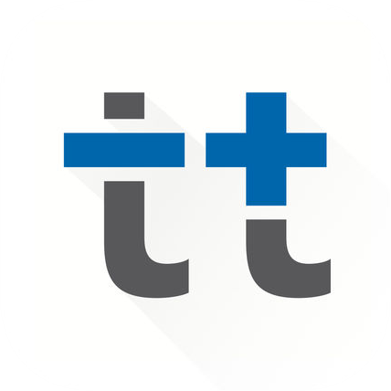
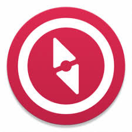

Discover the must-have apps any traveler should have on his/her smartphone...

<b>Maps.me - Find your way!</b>

When it comes to travel abroad, there will always be a time when you'll need to find your location.
And you might not want to carry a physical map nor even less buy a SIM card to get data to use your current favorite app (Google Maps, Apple Maps,…).

Maps.Me features off-line maps and a smart navigation system based on the OpenStreetMap community.
Basically, you first need to upload (over wifi for instance) the map of a city / country you're willing to visit, and then you'll be able to access any relevant data related to this location : sightseeing, restaurants, bars, shops,  metro lines, treks,…and navigate through them.

It's a powerful app I've been using the last 7 years and today I couldn't travel without it.

#Tip : most of the treks or paths have been added by the OSM community making this app a must-have for trekking abroad !

<b>GoogleDrive - Save your documents !</b>

GoogleDrive is THE reference to safely store all your documents and sync them between your laptop/phone/tablet (via google.com or the specific app)
It's also a good alternative to share pics or videos with friends/family by giving them access to some specific folders.
Your first 15 GB of storage are free with a Google account!

#Tip : make your important documents (passport, Bank account number,…) available offline to be able to access them anywhere at anytime.

<b> Revolut - Spend your money (wisely) ! </b>

Revolut is a digital bank that will help you save money on currency exchange. 

Most of banks charge around 2% fees for any transaction made abroad while Revolut won't. You can even buy foreign currency in advance (for instance if the currency of your next destination drops a few months before your departure) to prepare your trip in the best conditions. All transactions, currency wallets and physical card are managed through the app which has a really user-friendly and ergonomic interface (you can easily block your account, or disable contact less / internet payment,..). 

I love it so far.
You can use my code to get a free card by signing with https://revolut.com/referral/benjam9or

#Tip : link your current bank account on Revolut and you won't ever need to connect to your bank to transfer money : one click and your Revolut is re-charged!

<b>Tricount : Organise your group expense !</b>

Tricount will simplify your group expense in the most easy way : just fill in who pay what for who in the app and Tricount will do the maths ! You'll never again split a restaurant bill between friends the same way! 

#Tip : share your tricount expenses with friends so that everyone can fill in his/her expenses 

<b> Evernote : Share your thoughts ! </b>

Evernote is the ultime app to store your notes, to-do lists, check lists, and even more ! For instance this post has been written via Evernote and then published on blogger. You can also use it to write and save your journal to eventually share your stories worldwide !

#Tip : with a free account you can sync 2 devices - perfect to start a note on your smartphone and finish it later on your laptop 

<b> Polarsteps - Share your pics ! </b>

Polarsteps allow you to share your travel pictures on an interactive map, with a user-friendly interface.

I'm currently trying this app for my Asian trip ! Check it out here.

#Tip : enable GPS tracker to know exactly where you've been and ease your pictures upload.